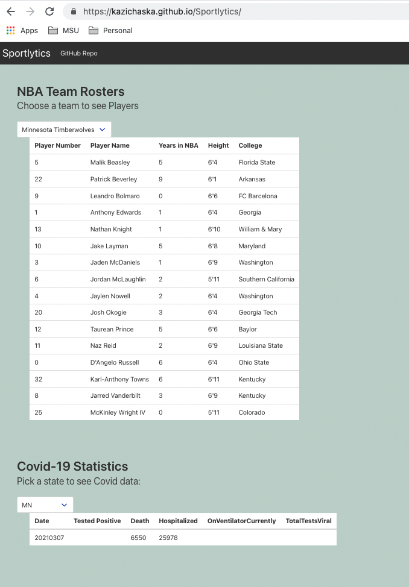

# Sportlytics

### Link of deployed application: 
https://kazichaska.github.io/Sportlytics/ 

##  Purpose
A one stop website where you can get information about your favorite NBA team and get up to date stats about Covid-19.

## Tools Used
* HTML
* CSS
* Bulma CSS framework
* Javascript
* NBA API: http://data.nba.net/10s/prod/v1/2021/players.json
* Covid-19 API: https://api.covidtracking.com/v1/states/current.json

### Screenshots of the code

## In use

## Contributors
* Kazi Islam
* Alejandro Salas
* Kerry Long
* Fabian Uribe